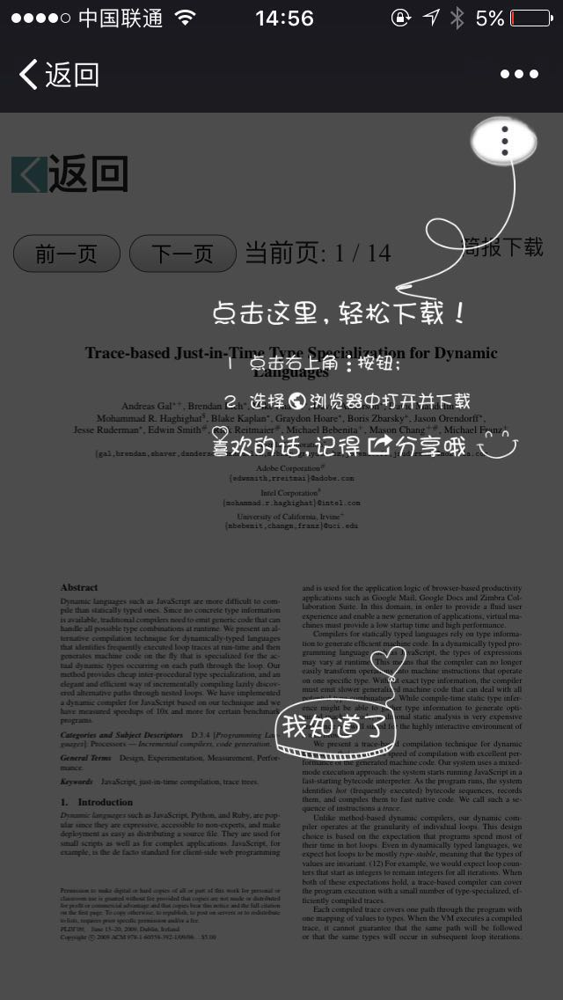

# wechat-file-download-page
> a h5 page to view and download pdf file in wechat webview

### Build
this project built with webpack. for debug. just using
```
npm start
```
for build. just using
```
npm run build
```

## Usage
1. deploy wechat-file-download-page to your website
2. add query params `url=your_pdf_url`
3. for example 
    ```
    http://www.{your_domain}.com/path/to/wechat-file-download-page?url=your_pdf_url
    ```
it should works just fine!  


## Speical Thanks
[es6-webpack2-starter](https://github.com/micooz/es6-webpack2-starter)

## License
MIT@eegrid.com